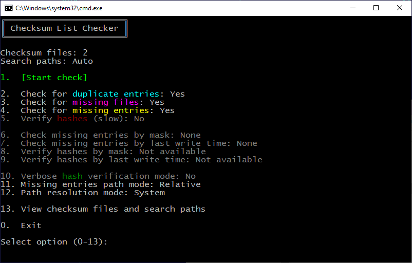
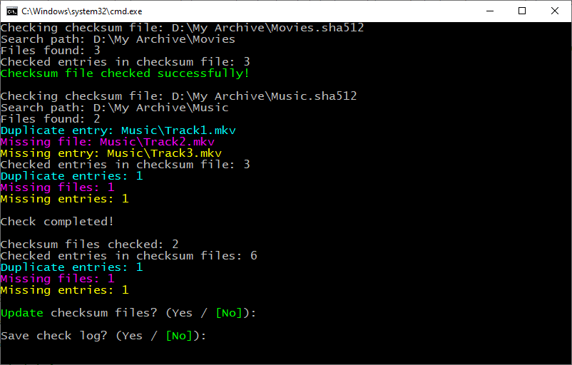

[](README.md) [](README.ru.md)

# Checksum List Checker

**Checksum List Checker** checks checksum lists contained in `.sfv` (CRC-32), `.md5`, `.sha1`, `.sha256`, `.sha384`, `.sha512` files: it detects missing files, missing entries, and duplicate entries, with or without verifying existing hashes, and also updates (synchronizes) checksum lists by fixing detected errors and adding entries for new files found in the specified search paths. Hash verification and new entries can be filtered by file name mask and last write time.

The utility is a standalone `.bat` file and requires no installation.

> 💡 This utility was developed by me for personal use. Its primary purpose was to automate integrity checks of my home archive stored on removable hard drives, as well as to quickly add new entries without having to recalculate all the hashes in the checksum files.

## 📖 Usage

### 🚀 Running Without Parameters

When run without parameters (for example, by double-clicking), the utility automatically searches the directory containing `ChecksumListChecker.bat` for checksum files in supported formats.

Search paths are automatically determined for each found checksum file according to the following rules:

- if a directory with the same name as the checksum file exists in the directory containing the checksum file, that directory is used as the search path;
- if no directory with that name exists, the directory containing the checksum file itself is used as the search path.

### 🖱️ Drag-and-Drop

Files and directories can be dragged directly onto `ChecksumListChecker.bat`. Supported checksum files are automatically added to the list for checking, while directories and other files are specified as search paths.

### 💻 Running from the Command Line

The utility accepts command-line arguments, including paths to files and directories. Files and directories can be specified in any order; the utility automatically determines the checksum files and search paths. When checking multiple checksum files, the specified search paths are applied to all files being checked.

Paths to files and directories can be specified using the `?` and `*` wildcards in the last path component.

If no checksum files or search paths are specified, they are automatically determined according to the rules for running without parameters.

> 💡 This utility is not intended for directly creating new checksum files. There are many faster and more advanced programs for this purpose. However, when processing a manually created empty file, the utility will fill it with a checksum list for files found in the search paths.

## 🖥️ Interface

### 📋 Menu

When the utility is launched, an interactive menu is displayed:



The checksum file name and search path are displayed above the menu. When multiple files or paths are specified, their count is shown.

| Menu item                                      | Description                                                                                                                                                                            |
| ---------------------------------------------- | -------------------------------------------------------------------------------------------------------------------------------------------------------------------------------------- |
| `1.  [Start check]`                            | Start checking checksum files. This is the default when the input is empty and Enter is pressed.                                                                                       |
| `2.  Check for duplicate entries`              | Enable checking for duplicate entries in checksum lists. When updating, all duplicate entries except the first one will be removed. Enabled by default.                                |
| `3.  Check for missing files`                  | Enable checking whether the files specified in checksum lists exist. When updating, entries for missing files will be removed. Enabled by default.                                     |
| `4.  Check for missing entries`                | Enable checking for entries corresponding to files found in the search paths. When updating, entries for new files will be added to the end of each checksum file. Enabled by default. |
| `5.  Verify hashes (slow)`                     | Enable hash verification for entries in checksum lists. Has three modes (see below).                                                                                                   |
| `6.  Check missing entries by mask`            | Set file name mask for checking missing entries. No mask is set by default.                                                                                                            |
| `7.  Check missing entries by last write time` | Set mode for checking missing entries only for files no older than the specified creation or modification time. No time is set by default.                                             |
| `8.  Verify hashes by mask`                    | Set file name mask for hash verification. No mask is set by default.                                                                                                                   |
| `9.  Verify hashes by last write time`         | Set mode for hash verification only for files no older than the specified creation or modification time. No time is set by default.                                                    |
| `10. Verbose hash verification mode`           | Enable verbose mode to display all hash calculation messages. Only errors are shown by default.                                                                                        |
| `11. Missing entries path mode`                | Set the path mode for missing entries to absolute or relative paths. Relative paths are selected by default.                                                                           |
| `12. Path resolution mode`                     | Set the path resolution mode. With the internal mode, trailing dots and spaces in file and directory names are not trimmed. The system mode is selected by default.                    |
| `13. View checksum files and search paths`     | Display a list of all checksum files and search paths being checked. Afterward, prompts the user to create a new list.                                                                 |
| `0.  Exit`                                     | Exit the utility.                                                                                                                                                                      |

Menu item `5. Verify hashes (slow)` has three modes:

`No` — do not verify hashes. In this mode, a quick check of the file entries will be performed. When updating, existing hashes will not be changed. This mode is enabled by default.

`All` — verify hashes for all entries in the checksum lists. In this mode, a slow hash verification will be performed. When updating, existing hashes will be overwritten with newly calculated values.

`Search paths` — verify hashes only for entries corresponding to files located in the search paths. In this mode, hashes can be updated only for known modified files located in the specified paths.

In hash verification mode, messages about missing files are also displayed, but when updating, if checking for missing files is disabled, entries will not be removed.

When checking for duplicate entries is enabled, the hash will be calculated only for the first occurrence found.

File name masks are specified using the standard wildcard characters `*`, `?`, `[`, and `]`. The backtick `` ` `` is used to escape wildcard characters. The vertical bar `|` is used as the mask separator. If the mask contains a backslash `\`, it is applied to the full file path.

⚠️ Menu items `7. Check missing entries by last write time` and `9. Verify hashes by last write time` allows checking only files that are no older than the specified creation or modification time. The utility ignores the time when a file was renamed or moved from another folder on the same drive.

### 📝 Check Results

During the check, information about detected errors and overall check statistics is displayed:



If checksum list errors are detected, a prompt to update the files is displayed.

When the operation is complete, the utility will prompt you to save the log to a text file.

## 💻 Command-Line Options

The command-line syntax is as follows:

```cmd
ChecksumListChecker.bat [options, checksum file paths, and search paths in any order] [-- search paths only]
```

| Option                         | Description                                                                                                                       |
| ------------------------------ | --------------------------------------------------------------------------------------------------------------------------------- |
| `--`                           | Separator after which all options and paths are interpreted as search paths.                                                      |
| `-c`, `--check`                | Check checksum files without displaying the menu.                                                                                 |
| `-u`, `--update`               | Update checksum files without displaying the menu.                                                                                |
| `-s`, `--safe-update`          | Update checksum files only if there are no execution errors, without displaying the menu.                                         |
| `-d`, `--skip-duplicates`      | Disable checking for duplicate entries in checksum lists. Enabled by default.                                                     |
| `-f`, `--skip-missing-files`   | Disable checking whether files specified in checksum lists exist. Enabled by default.                                             |
| `-e`, `--skip-missing-entries` | Disable checking whether entries exist for files found in the search paths. Enabled by default.                                   |
| `-h`, `--verify-all-hashes`    | Enable hash verification for all entries in checksum lists. Disabled by default.                                                  |
| `-p`, `--verify-paths-hashes`  | Enable hash verification for entries in checksum lists only for files located in the search paths. Disabled by default.           |
| `-v`, `--verbose-hashes`       | Enable the display of all hash calculation messages. Disabled by default.                                                         |
| `-a`, `--absolute-paths`       | Enable absolute file paths for missing entries. Relative paths are used by default.                                               |
| `-i`, `--internal-resolution`  | Enable the internal path resolution mode. The system mode is used by default.                                                     |
| `-l`, `--save-log`             | Save the log without prompting for confirmation.                                                                                  |
| `-n`, `--no-auto`              | Disable automatic search for files and paths.                                                                                     |
| `-q`, `--quiet`                | Disable the menu and final pause.                                                                                                 |
| `--entries-include=$`          | Enable checking only for entries corresponding to files matching the specified mask, where `$` is the mask value.                 |
| `--entries-exclude=$`          | Enable checking only for entries corresponding to files not matching the specified mask, where `$` is the mask value.             |
| `--entries-time-minutes=#`     | Enable checking only for entries corresponding to files no older than the specified time, where `#` is the time value in minutes. |
| `--entries-time-hours=#`       | Enable checking only for entries corresponding to files no older than the specified time, where `#` is the time value in hours.   |
| `--entries-time-days=#`        | Enable checking only for entries corresponding to files no older than the specified time, where `#` is the time value in days.    |
| `--entries-time-months=#`      | Enable checking only for entries corresponding to files no older than the specified time, where `#` is the time value in months.  |
| `--entries-time-years=#`       | Enable checking only for entries corresponding to files no older than the specified time, where `#` is the time value in years.   |
| `--hashes-include=$`           | Enable hash verification only for files matching the specified mask, where `$` is the mask value.                                 |
| `--hashes-exclude=$`           | Enable hash verification only for files not matching the specified mask, where `$` is the mask value.                             |
| `--hashes-time-minutes=#`      | Enable hash verification only for files no older than the specified time, where `#` is the time value in minutes.                 |
| `--hashes-time-hours=#`        | Enable hash verification only for files no older than the specified time, where `#` is the time value in hours.                   |
| `--hashes-time-days=#`         | Enable hash verification only for files no older than the specified time, where `#` is the time value in days.                    |
| `--hashes-time-months=#`       | Enable hash verification only for files no older than the specified time, where `#` is the time value in months.                  |
| `--hashes-time-years=#`        | Enable hash verification only for files no older than the specified time, where `#` is the time value in years.                   |

### ⚠️ Command-Line Limitations

Paths and options containing spaces or special CMD command-line characters (for example, `|`, `&` and `^`) must be enclosed in quotation marks.

Relative paths are resolved relative to the current directory. When using UNC paths, the full path must be specified, as CMD does not support UNC paths as the current directory.

It is recommended to use a console font that supports Unicode characters.

### 💡 Command-Line Examples

Check the `Movies.sha512` file with automatic search path detection and save the log without displaying the menu:

```cmd
ChecksumListChecker.bat --check --save-log Movies.sha512
```

Hash verification for entries in the `Movies.sha512` and `MoviesOld.sha512` checksum files without displaying the menu:

```cmd
ChecksumListChecker.bat --check --verify-all-hashes Movies.sha512 MoviesOld.sha512
```

Update without adding new entries (only removing duplicates and entries for non-existent files) in the checksum files `Movies.sha512`, `Music.sha512`, and `My Archive.sha512`, without displaying the menu:

```cmd
ChecksumListChecker.bat --update --skip-missing-entries Movies.sha512 Music.sha512 "My Archive.sha512"
```

Only add new entries for `.mkv` and `.avi` files no older than one day from the `NewMovies` directory without removing duplicates or entries for non-existent files from the `Movies.sha512` checksum file, without displaying the menu (short option bundling):

```cmd
ChecksumListChecker.bat -udf --entries-include="*.mkv|*.avi" --entries-time-days=1 Movies.sha512 NewMovies
```

Updating the hashes of the `Movies.sha512` and `Music.sha512` files themselves in the `My Archive.sha512` file without displaying the menu:

```cmd
ChecksumListChecker.bat --update --verify-paths-hashes "My Archive.sha512" -- Movies.sha512 Music.sha512
```

### 🚦 Exit Codes

| Code   | Description                                                                            |
| ------ | -------------------------------------------------------------------------------------- |
| `0`    | No errors detected.                                                                    |
| `1000` | Checksum files not found.                                                              |
| `1001` | Error reading checksum file.                                                           |
| `1002` | Error updating checksum file.                                                          |
| `1004` | Error calculating hash for an existing entry.                                          |
| `1008` | Error calculating hash when adding an entry.                                           |
| `1016` | Search error.                                                                          |
| `1032` | Checksum list errors (duplicates, missing files, missing entries, or hash mismatches). |
| `1064` | Entries not found in checksum files.                                                   |
| `1128` | Files not found in search paths.                                                       |
| `2000` | Command-line syntax error.                                                             |

The last digits of error codes may be combined by addition when multiple errors occur:

```text
1008 + 1016 + 1032 = 1056
```

## ⚙️ Technical Details

The utility is implemented as a standalone `.bat` file with an embedded PowerShell script.

A small part of the BAT file is responsible for launching PowerShell and passing the arguments.

The PowerShell part handles checksum processing and the main logic.

The hash algorithm to be checked is determined by the file extension. For `.sfv` files, the hash is verified using the CRC-32 algorithm via the Windows `ntdll.dll` library.

Checksum files encoded in UTF-8, UTF-16, and ANSI (the Windows code page set by language settings) are supported.

When searching for new files, the checksum file being checked and the `ChecksumListChecker.bat` file itself are ignored.

A backup copy of the checksum file is created before it is updated.

## 💻 Recommended System Requirements

Windows 10 with PowerShell 5.1 is recommended for running the utility.

## 📄 License

Standard MIT License. License information is available in the LICENSE file.
