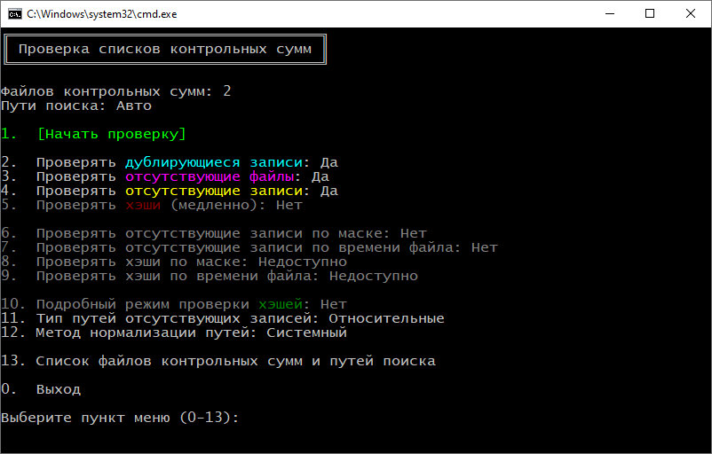
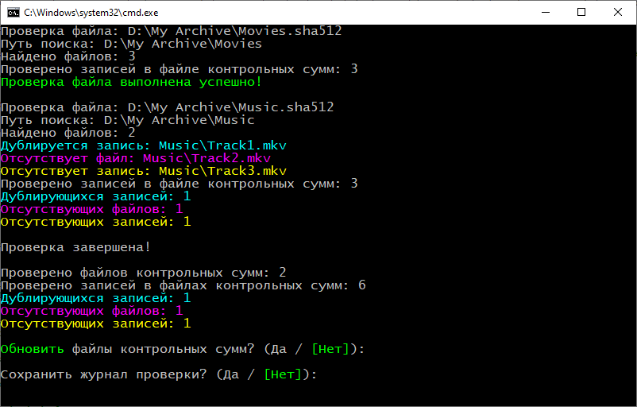

[](README.md) [](README.ru.md)

# Checksum List Checker

**Checksum List Checker** проверяет списки контрольных сумм в файлах `.sfv` (CRC-32), `.md5`, `.sha1`, `.sha256`, `.sha384`, `.sha512`: обнаруживает отсутствующие файлы, отсутствующие записи и дубликаты записей, с проверкой или без проверки существующих хэшей, а также обновляет (синхронизирует) списки контрольных сумм с исправлением найденных ошибок и добавлением записей о новых файлах, обнаруженных по указанным путям поиска. Проверку хэшей и добавление записей можно ограничить маской имени файла и временем последней записи.

Утилита представляет собой автономный `.bat`-файл и не требует установки.

> 💡 Данная утилита разрабатывалась мною для личного использования. Основной задачей была автоматизация проверки целостности моего домашнего архива на сменных жёстких дисках, а также быстрое добавление новых записей без необходимости пересчёта всех хэшей в файлах контрольных сумм.

## 📖 Использование

### 🚀 Запуск без параметров

При запуске без параметров (например, двойным кликом) утилита самостоятельно ищет файлы контрольных сумм поддерживаемых форматов в каталоге, в котором непосредственно расположен файл `ChecksumListChecker.bat`.

Пути поиска определяются автоматически для каждого найденного файла контрольных сумм по следующим правилам:

- если в каталоге, в котором расположен файл контрольных сумм, существует каталог с тем же именем, что и файл, то этот каталог используется в качестве пути поиска;
- если каталога с таким именем не существует, в качестве пути поиска используется каталог, в котором расположен сам файл контрольной суммы.

### 🖱️ Перетаскивание

Файлы и каталоги можно перетаскивать непосредственно на `ChecksumListChecker.bat`. При этом файлы контрольных сумм поддерживаемых форматов автоматически попадут в список для проверки, а каталоги и другие файлы будут указаны как пути поиска.

### 💻 Запуск с использованием командной строки

Утилита принимает аргументы командной строки, в том числе пути к файлам и каталогам. Файлы и каталоги могут быть указаны в любом порядке, утилита сама определит файлы контрольных сумм и пути поиска. При проверке нескольких файлов контрольных сумм указанные пути поиска будут одновременно применены ко всем проверяемым файлам.

Пути к файлам и каталогам могут быть указаны с использованием подстановочных знаков `?` и `*` в последнем компоненте пути.

Если файлы контрольных сумм или пути поиска не указаны, то они будут определены автоматически по правилам запуска без параметров.

> 💡 Напрямую данная утилита не предназначена для создания новых файлов контрольных сумм. Для этого существует множество более быстрых и продвинутых программ. Однако при обработке созданного вручную пустого файла утилита заполнит его списком контрольных сумм для файлов, обнаруженных по путям поиска.

## 🖥️ Интерфейс

### 📋 Меню

После запуска утилиты на экран выводится интерактивное меню:



Над меню выводятся имя файла контрольных сумм и путь поиска. При нескольких файлах или путях указывается их количество.

| Пункт меню                                            | Описание                                                                                                                                                                                                     |
| ----------------------------------------------------- | ------------------------------------------------------------------------------------------------------------------------------------------------------------------------------------------------------------ |
| `1.  [Начать проверку]`                               | Запуск проверки файлов контрольных сумм. Используется по умолчанию при пустом вводе и нажатии Enter.                                                                                                         |
| `2.  Проверять дублирующиеся записи`                  | Включение режима проверки дублирующихся записей в списках контрольных сумм. При обновлении все дублирующиеся записи, кроме первой, будут удалены. По умолчанию включён.                                      |
| `3.  Проверять отсутствующие файлы`                   | Включение режима проверки существования файлов, указанных в списках контрольных сумм. При обновлении записи об отсутствующих файлах будут удалены. По умолчанию включён.                                     |
| `4.  Проверять отсутствующие записи`                  | Включение режима проверки существования записей для файлов, обнаруженных по путям поиска. При обновлении записи о новых файлах будут добавлены в конец каждого файла контрольных сумм. По умолчанию включён. |
| `5.  Проверять хэши (медленно)`                       | Включение режима проверки хэшей для записей в списках контрольных сумм. Имеет три режима (см. ниже).                                                                                                         |
| `6.  Проверять отсутствующие записи по маске`         | Установка маски имён файлов при проверке отсутствующих записей. По умолчанию маска не задана.                                                                                                                |
| `7.  Проверять отсутствующие записи по времени файла` | Установка режима проверки отсутствующих записей для файлов не старше заданного времени создания или записи. По умолчанию время не задано.                                                                    |
| `8.  Проверять хэши по маске`                         | Установка маски имён файлов при проверке хэшей. По умолчанию маска не задана.                                                                                                                                |
| `9.  Проверять хэши по времени файла`                 | Установка режима проверки хэшей только для файлов не старше заданного времени создания или записи. По умолчанию время не задано.                                                                             |
| `10. Подробный режим проверки хэшей`                  | Включение подробного режима отображения всех сообщений о вычислении хэшей. По умолчанию отображаются только ошибки.                                                                                          |
| `11. Тип путей отсутствующих записей`                 | Установка абсолютных или относительных путей к файлам для отсутствующих записей. По умолчанию заданы относительные пути.                                                                                     |
| `12. Метод нормализации путей`                        | Установка метода нормализации путей. При использовании внутреннего метода не обрезаются завершающие точки и пробелы в именах файлов и каталогов. По умолчанию задан системный метод.                         |
| `13. Список файлов контрольных сумм и путей поиска`   | Вывод на экран списка всех проверяемых файлов контрольных сумм и путей поиска. По окончании выводится запрос на создание нового списка.                                                                      |
| `0.  Выход`                                           | Выход из утилиты.                                                                                                                                                                                            |

Пункт меню `5. Проверять хэши (медленно)` имеет три режима:

`Нет` — не проверять хэши. В этом режиме будет произведена быстрая проверка записей о файлах. При обновлении существующие хэши не будут изменены. Данный режим включён по умолчанию.

`Все` — проверять хэши для всех записей в списках контрольных сумм. В этом режиме будет произведена медленная проверка хэшей. При обновлении существующие хэши будут перезаписаны вновь вычисленными.

`По путям поиска` — проверять хэши записей в списках контрольных сумм только для файлов, расположенных по путям поиска. В этом режиме можно обновить хэши только для заранее известных изменённых файлов, расположенных по указанным путям.

В режиме проверки хэшей также выводятся сообщения об отсутствующих файлах, но при обновлении, если проверка отсутствующих файлов отключена, записи удалены не будут.

При включённой проверке дублирующихся записей хэш будет вычислен только для первой найденной записи.

Маски имён файлов задаются с использованием стандартных подстановочных знаков `*`, `?`, `[`, `]`. Для экранирования подстановочных знаков используется обратный апостроф `` ` ``. В качестве разделителя масок используется вертикальная черта `|`. Если маска содержит обратную косую черту `\`, она применяется к полному пути к файлу.

⚠️ Пункты меню `7. Проверять отсутствующие записи по времени файла` и `9. Проверять хэши по времени файла` позволяют проверять только файлы не старше заданного времени создания или записи. Утилита не учитывает время переименования или переноса файла из другой папки того же диска.

### 📝 Результаты проверки

В процессе проверки выводится информация о найденных ошибках и общая статистика по результатам проверки:



При наличии ошибок списка контрольных сумм выводится запрос на обновление файлов.

По завершении работы утилита предложит сохранить журнал в текстовый файл.

## 💻 Параметры командной строки

Синтаксис командной строки выглядит следующим образом:

```cmd
ChecksumListChecker.bat [параметры, пути к файлам контрольных сумм и пути поиска в любом порядке] [-- только пути поиска]
```

| Параметр                       | Описание                                                                                                                                     |
| ------------------------------ | -------------------------------------------------------------------------------------------------------------------------------------------- |
| `--`                           | Разделитель, после которого все параметры и пути интерпретируются как пути поиска.                                                           |
| `-c`, `--check`                | Проверка файлов контрольных сумм без вывода меню.                                                                                            |
| `-u`, `--update`               | Обновление файлов контрольных сумм без вывода меню.                                                                                          |
| `-s`, `--safe-update`          | Обновление файлов контрольных сумм только при отсутствии ошибок выполнения без вывода меню.                                                  |
| `-d`, `--skip-duplicates`      | Отключение проверки дублирующихся записей в списках контрольных сумм. По умолчанию проверка включена.                                        |
| `-f`, `--skip-missing-files`   | Отключение проверки существования файлов, указанных в списках контрольных сумм. По умолчанию проверка включена.                              |
| `-e`, `--skip-missing-entries` | Отключение проверки существования записей для файлов, обнаруженных по путям поиска. По умолчанию проверка включена.                          |
| `-h`, `--verify-all-hashes`    | Включение проверки хэшей для всех записей в списках контрольных сумм. По умолчанию проверка отключена.                                       |
| `-p`, `--verify-paths-hashes`  | Включение проверки хэшей записей в списках контрольных сумм только для файлов, находящихся по путям поиска. По умолчанию проверка отключена. |
| `-v`, `--verbose-hashes`       | Включение подробного режима отображения всех сообщений о вычислении хэшей. По умолчанию отображаются только ошибки.                          |
| `-a`, `--absolute-paths`       | Включение режима абсолютных путей к файлам для отсутствующих записей. По умолчанию используются относительные пути.                          |
| `-i`, `--internal-resolution`  | Включение внутреннего метода нормализации путей. По умолчанию задан системный метод.                                                         |
| `-l`, `--save-log`             | Сохранение журнала без запроса подтверждения.                                                                                                |
| `-n`, `--no-auto`              | Отключение автоматического поиска файлов и путей.                                                                                            |
| `-q`, `--quiet`                | Отключение вывода меню и финальной паузы.                                                                                                    |
| `--entries-include=$`          | Включение проверки отсутствия записей только для файлов, соответствующих заданной маске, где `$` - значение маски.                           |
| `--entries-exclude=$`          | Включение проверки отсутствия записей только для файлов, не соответствующих заданной маске, где `$` - значение маски.                        |
| `--entries-time-minutes=#`     | Включение проверки отсутствия записей только для файлов не старше указанного времени, где `#` - значение времени в минутах.                  |
| `--entries-time-hours=#`       | Включение проверки отсутствия записей только для файлов не старше указанного времени, где `#` - значение времени в часах.                    |
| `--entries-time-days=#`        | Включение проверки отсутствия записей только для файлов не старше указанного времени, где `#` - значение времени в днях.                     |
| `--entries-time-months=#`      | Включение проверки отсутствия записей только для файлов не старше указанного времени, где `#` - значение времени в месяцах.                  |
| `--entries-time-years=#`       | Включение проверки отсутствия записей только для файлов не старше указанного времени, где `#` - значение времени в годах.                    |
| `--hashes-include=$`           | Включение проверки хэшей только для файлов, соответствующих заданной маске, где `$` - значение маски.                                        |
| `--hashes-exclude=$`           | Включение проверки хэшей только для файлов, не соответствующих заданной маске, где `$` - значение маски.                                     |
| `--hashes-time-minutes=#`      | Включение проверки хэшей только для файлов не старше указанного времени, где `#` - значение времени в минутах.                               |
| `--hashes-time-hours=#`        | Включение проверки хэшей только для файлов не старше указанного времени, где `#` - значение времени в часах.                                 |
| `--hashes-time-days=#`         | Включение проверки хэшей только для файлов не старше указанного времени, где `#` - значение времени в днях.                                  |
| `--hashes-time-months=#`       | Включение проверки хэшей только для файлов не старше указанного времени, где `#` - значение времени в месяцах.                               |
| `--hashes-time-years=#`        | Включение проверки хэшей только для файлов не старше указанного времени, где `#` - значение времени в годах.                                 |

### ⚠️ Ограничения командной строки

Пути и параметры, содержащие пробелы или специальные символы командной строки CMD (например, `|`, `&` и `^`), должны быть заключены в кавычки.

Относительные пути разрешаются относительно текущего каталога. При использовании путей UNC необходимо указывать полный путь, так как CMD не поддерживает пути UNC в качестве текущего каталога.

Рекомендуется использовать консольный шрифт, поддерживающий символы Юникода.

### 💡 Примеры командной строки

Проверка файла `Movies.sha512` с автоматическим определением пути поиска и записью журнала без вывода меню:

```cmd
ChecksumListChecker.bat --check --save-log Movies.sha512
```

Проверка хэша для записей в файлах контрольных сумм `Movies.sha512` и `MoviesOld.sha512` без вывода меню:

```cmd
ChecksumListChecker.bat --check --verify-all-hashes Movies.sha512 MoviesOld.sha512
```

Обновление без добавления новых записей (только удаление дубликатов и записей о несуществующих файлах) в файлах контрольных сумм `Movies.sha512`, `Music.sha512`, `My Archive.sha512` без вывода меню:

```cmd
ChecksumListChecker.bat --update --skip-missing-entries Movies.sha512 Music.sha512 "My Archive.sha512"
```

Только добавление новых записей для файлов с расширениями `.mkv` и `.avi` не старше одного дня из каталога `NewMovies` без удаления дубликатов и записей о несуществующих файлах в файле контрольных сумм `Movies.sha512` без вывода меню (группировка коротких опций):

```cmd
ChecksumListChecker.bat -udf --entries-include="*.mkv|*.avi" --entries-time-days=1 Movies.sha512 NewMovies
```

Обновление хэшей самих файлов `Movies.sha512` и `Music.sha512` в файле `My Archive.sha512` без вывода меню:

```cmd
ChecksumListChecker.bat --update --verify-paths-hashes "My Archive.sha512" -- Movies.sha512 Music.sha512
```

### 🚦 Коды возврата

| Код    | Описание                                                                                                   |
| ------ | ---------------------------------------------------------------------------------------------------------- |
| `0`    | Ошибки не обнаружены.                                                                                      |
| `1000` | Файлы контрольных сумм не найдены.                                                                         |
| `1001` | Ошибка чтения файла контрольных сумм.                                                                      |
| `1002` | Ошибка обновления файла контрольных сумм.                                                                  |
| `1004` | Ошибка вычисления хэша для существующей записи.                                                            |
| `1008` | Ошибка вычисления хэша при добавлении записи.                                                              |
| `1016` | Ошибка поиска.                                                                                             |
| `1032` | Ошибка списка контрольных сумм (дубликаты, отсутствующие файлы, отсутствующие записи, несовпадение хэшей). |
| `1064` | Записи в файлах контрольных сумм не найдены.                                                               |
| `1128` | Файлы по путям поиска не найдены.                                                                          |
| `2000` | Ошибка синтаксиса командной строки.                                                                        |

Последние цифры кодов ошибок могут суммироваться при возникновении нескольких ошибок:

```text
1008 + 1016 + 1032 = 1056
```

## ⚙️ Технические особенности

Утилита реализована как автономный `.bat`-файл со встроенным скриптом PowerShell.

Небольшая часть BAT отвечает за запуск PowerShell и передачу аргументов.

Часть PowerShell отвечает непосредственно за обработку контрольных сумм и основную логику.

Алгоритм проверяемого хэша определяется расширением файла. Для файлов с расширением `.sfv` проверяется хэш по алгоритму CRC-32 с использованием библиотеки Windows `ntdll.dll`.

Поддерживаются файлы контрольных сумм в кодировках UTF-8, UTF-16 и ANSI (кодовая страница Windows, определяемая языковыми настройками).

При поиске новых файлов проверяемый файл контрольной суммы и сам файл `ChecksumListChecker.bat` игнорируются.

Перед обновлением файла контрольных сумм создаётся его резервная копия.

## 💻 Рекомендуемые системные требования

Для работы утилиты рекомендуется использовать Windows 10 с PowerShell 5.1.

## 📄 Лицензия

Стандартная лицензия MIT. Информация о лицензии находится в файле LICENSE.
